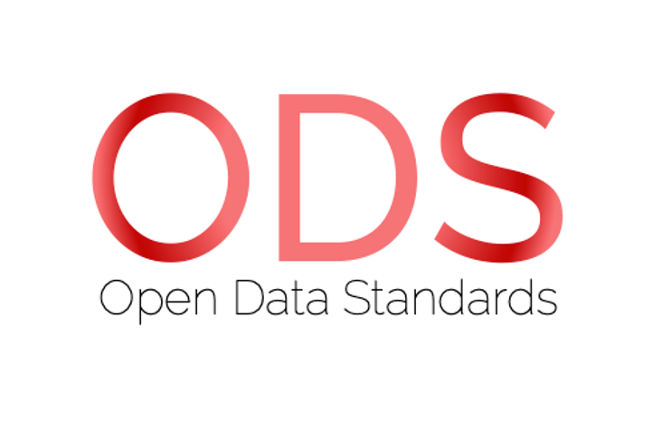

# ODS_OpenResultsData
Open Results Data (ORD), part of the Open Data Standard (ODS) initiative curated by Oasis. 

&nbsp; &nbsp; &nbsp; &nbsp; &nbsp; &nbsp; &nbsp; &nbsp; &nbsp; &nbsp; &nbsp; &nbsp; &nbsp; &nbsp; &nbsp; &nbsp; &nbsp; &nbsp; &nbsp; &nbsp; &nbsp; &nbsp; &nbsp; 
&nbsp; &nbsp; &nbsp; &nbsp; &nbsp; 
  

## Mission Statement: 
***ODS should be the standard used for exposure data, result outputs and contract(s) terminology for the (Re)Insurance industry and other interested parties in catastrophe modelling and exposure management across all classes of business.***

&nbsp; 

# Open Data Standards (ODS)

ODS is curated by Oasis LMF and governed by the Open Data Standards Steering Committee (SC), comprised of industry experts representing (re)insurers, brokers, service providers and catastrophe model vendors. 

Further information and community views of ODS can be found on the ODS website:
https://oasislmf.org/open-data-standards

&nbsp; 

## Open Results Data (ORD)

ORD was initially developed during the Lloyd's Lab innovation project (Cohort 3) in 2019, by a working group led by Oasis, that focussed on constructing model agnostic results formats and appropriate data formats. These model outputs cover an extensive suite of results that can be isolated by aspects of the exposure data, financial and statistical perspectives. 

&nbsp; 

## Releases and Versioning 

This is a separate repository specifically for the Open Results Data (ORD) standard which will be developed and versioned independently of the Open Exposure Data (OED) standard (https://github.com/OasisLMF/ODS_OpenExposureData). The releases and versioning of ORD will follow the same format as OED using the SemVer convention (https://semver.org/), so given a version number MAJOR.MINOR.PATCH increments:

   * **MAJOR** version when you make incompatible changes e.g. changing column names, changing the structure of the data.
    
   * **MINOR** version when you add functionality in a backwards compatible manner e.g. adding a new column with a default value, adding a new allowed value for an existing field.
    
   * **PATCH** version when you make backwards compatible bug fixes e.g. correcting a typo in a column label.
   
All new work will be done in **feature** branches, following the [GitFlow model](https://nvie.com/posts/a-successful-git-branching-model/). The latest released version will be held in the **master** branch and the current development work will be in develop or specific feature branches.

&nbsp; 

## Governance and Signoff

All details of the ODS governance and signoff process and the role of the ODS Steering Committee can be found on the OED repo (https://github.com/OasisLMF/ODS_OpenExposureData).

&nbsp; 

## License
The content of ODS including the documentation and the schema within both Open Exposure Data (OED) and Open Results Data (ORD) are licensed under the CC0 1.0 Universal license.
Any code, MS SQL scripts or the development of tools are licensed under BSD 3-clause license.
